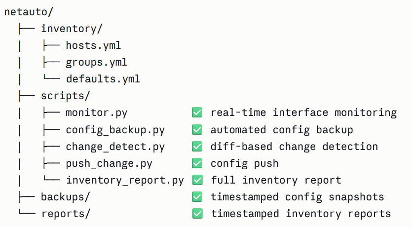

# NetAuto — Multi-Vendor Network Automation Toolkit

A Python-based network automation toolkit for monitoring, backup, change detection,
and inventory reporting across multi-vendor Cisco environments.

Built with **Nornir** and **Netmiko** — no Ansible, no YAML playbooks, pure Python.

---

## Stack

| Tool | Purpose |
|---|---|
| Python 3.11 | Core language |
| Nornir 3.x | Multi-device orchestration |
| Netmiko 4.x | SSH connectivity |
| uv | Package management |

---

## Supported Platforms

| Device | OS | Status |
|---|---|---|
| Cisco Catalyst 8000v | IOS XE 17.x | ✅ Full support |
| Cisco Nexus 9000v | NX-OS 9.x | ✅ Full support |
| Cisco IOS XRv | IOS XR | ⚠️ ssh-dss limitation |

---

## Project Structure



---

## Getting Started

### 1. Install uv

```bash
curl -LsSf https://astral.sh/uv/install.sh | sh
```

### 2. Clone and set up the environment

```bash
git clone https://github.com/<your-username>/netauto.git
cd netauto

uv venv --python 3.11 --seed
source .venv/bin/activate        # Linux/macOS
# .venv\Scripts\activate         # Windows

uv pip install "setuptools==69.5.1"
uv pip install netmiko
uv pip install nornir nornir-netmiko nornir-utils
```

### 3. Configure your inventory

Edit `inventory/hosts.yml` with your device credentials:

```yaml
cat8kv:
  hostname: "10.10.20.48"
  port: 22
  username: "developer"
  password: "C1sco12345"
  groups:
    - cisco_iosxe

nexus9k:
  hostname: "10.10.20.40"
  port: 22
  username: "admin"
  password: "your-password"
  groups:
    - cisco_nxos
```

### 4. Run the scripts

```bash
# Real-time interface monitoring (3 cycles, 30s interval)
python scripts/monitor.py

# Backup running configs from all devices
python scripts/config_backup.py

# Detect config changes since last backup
python scripts/change_detect.py

# Generate full inventory report
python scripts/inventory_report.py
```

---

## Script Details

### monitor.py
Polls all devices every 30 seconds and displays a clean UP/DOWN
interface summary per device. Runs in parallel using Nornir threads.

┌─ CAT8KV
│  UP   (6)
│   ✅ GigabitEthernet1          10.10.20.48
│   ✅ Loopback0                 10.0.0.1
│  DOWN (2)
│   ❌ GigabitEthernet2          unassigned
└────────────────────────────────────────

### config_backup.py
Fetches running-config from all devices and saves them as
timestamped `.cfg` files under `backups/`.

✅ CAT8KV   → backups/cat8kv_20260530_150134.cfg (246 lines)
✅ NEXUS9K  → backups/nexus9k_20260530_150134.cfg (255 lines)

### change_detect.py
Compares current running-config against the latest backup using
unified diff. Highlights added lines in green and removed lines
in red. Saves a new backup when changes are found.

⚠️  CHANGES DETECTED — +4 lines / -0 lines
+interface Loopback99

description NETAUTO-TEST-CHANGE
ip address 10.99.99.1 255.255.255.255

### inventory_report.py
Generates a full structured report per device including:
- Software version and hardware platform
- System uptime and serial number
- Interface UP/DOWN summary with IP addresses
- Routing table summary
- CDP neighbor table

Report is printed to screen and saved to `reports/`.

---

## Lab Environment

Scripts were developed and tested against the
**Cisco DevNet Sandbox** (reservable lab):

- Catalyst 8000v — IOS XE 17.12.2
- Nexus 9000v — NX-OS 9.3(5)

Access requires Cisco DevNet account and VPN connection
via OpenConnect or Cisco AnyConnect.

→ [devnetsandbox.cisco.com](https://devnetsandbox.cisco.com)

---

## Author

**Marcus** — Senior Network & Security Engineer
> Building automation tools for multi-vendor environments.
> Focused on network operations, cybersecurity, and Python-based infrastructure tooling.

[](https://linkedin.com/in/mborile)

---

## License
MIT

